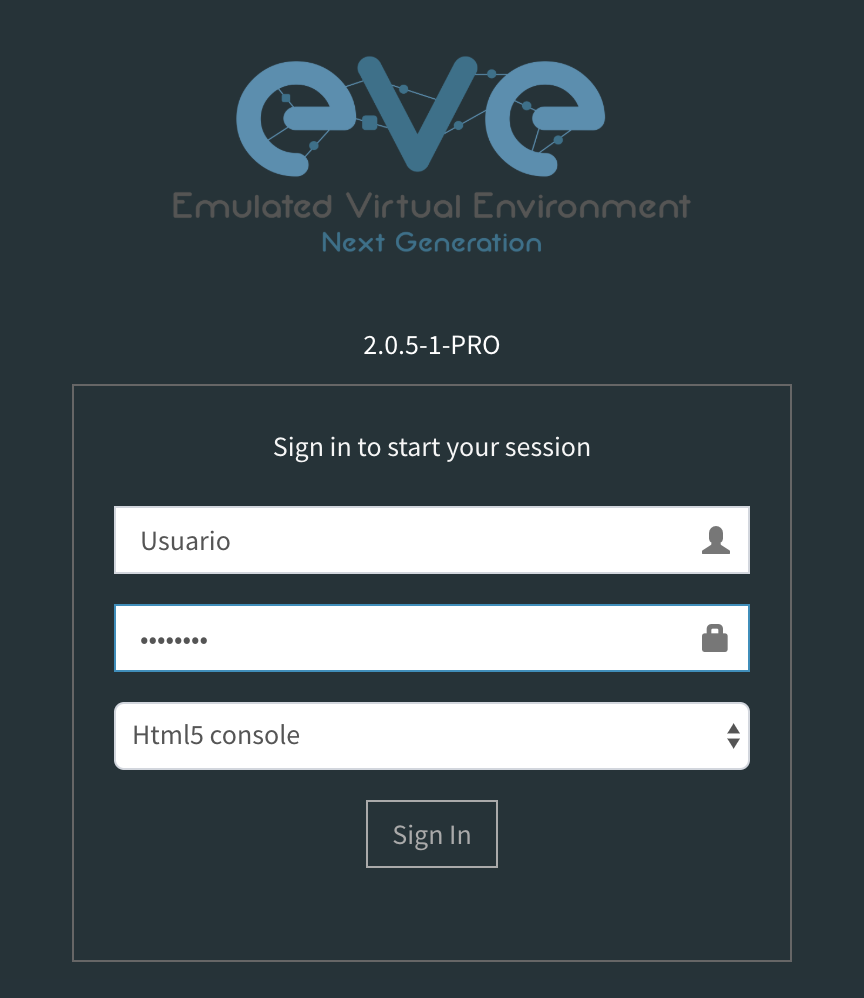
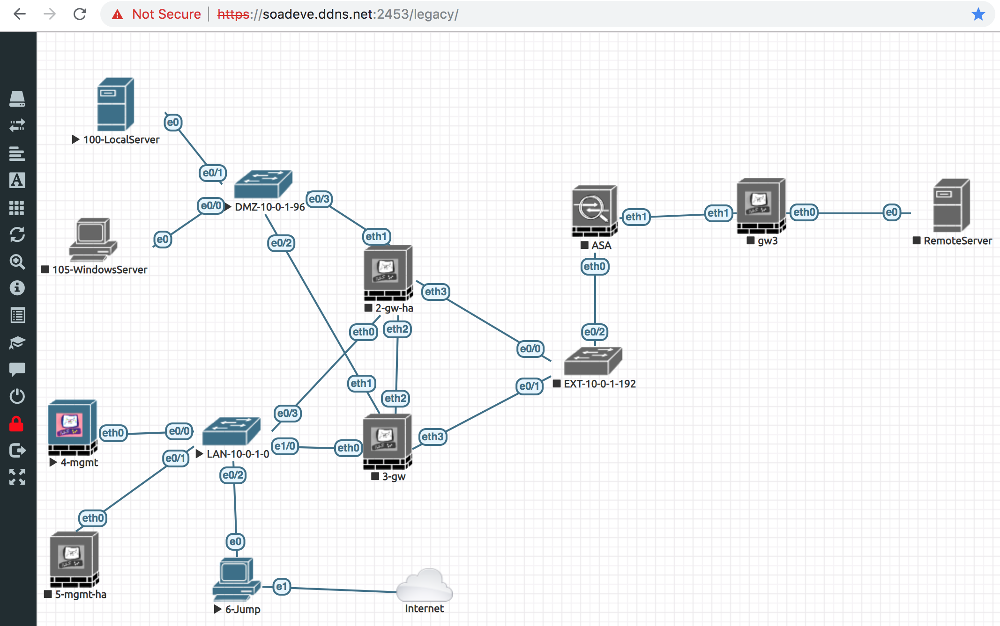
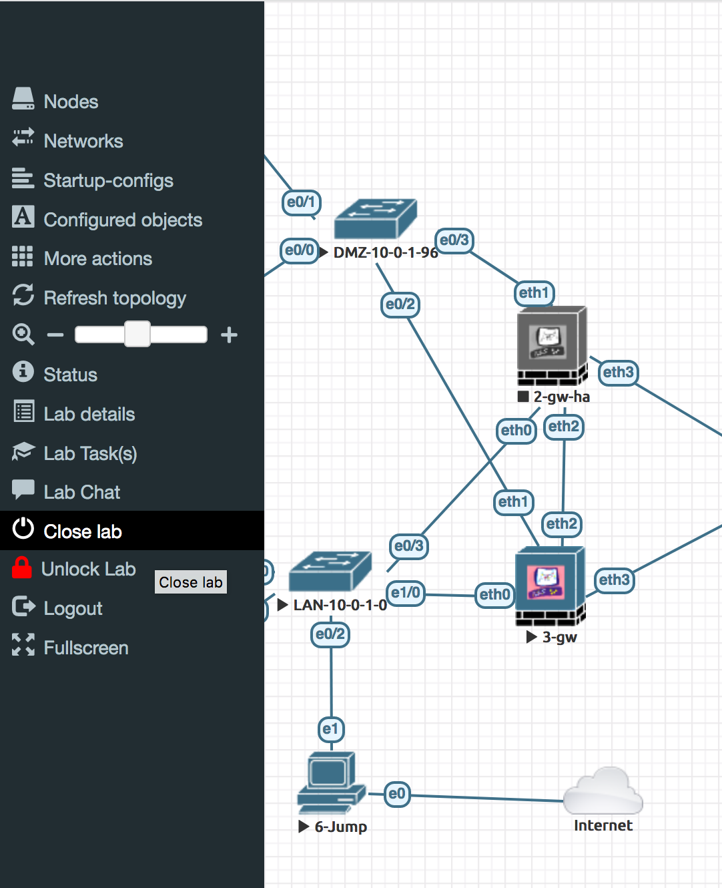
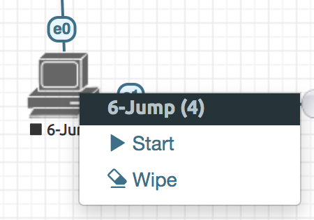
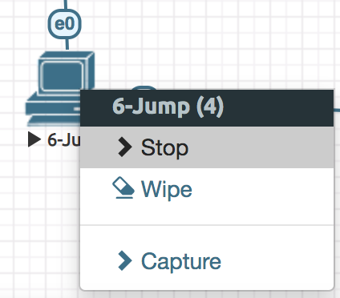
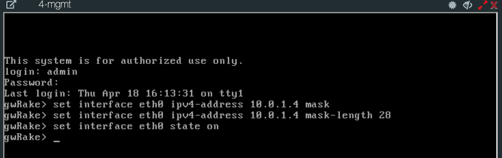
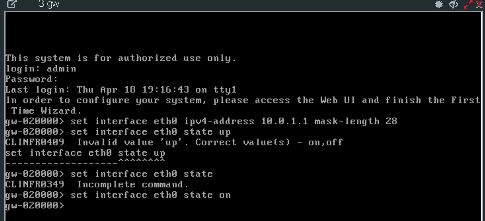
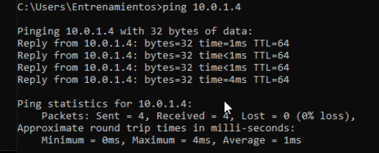

# Laboratorio 1: Configuracion de direccionamiento IP interno

|Equipo | hostname | IP | Mascara de red |
|--- | --- | --- | --- |
|Consola | cplabo | 10.0.1.250 | 255.255.255.0 |
|gw1 | fw1 | 10.0.1.251 | 255.255.255.0 |
|gw2 | fw2 | 10.0.1.252 | 255.255.255.0 |
|linux | cliente1 | 10.0.1.10 | 255.255.255.0 |

## Objetivos:

* Configurar las direcciones IP en los equipos de la tabla
* Lograr que ping de la consola a linux responda

### Paso 1 Acceso al laboratorio

La URL para acceder al laboratorio es la siguiente

https://soadeve.ddns.net:2453/#/login

Logear se con el usuario y paswords asignados
Seleccionar  Html5 console

Para este ejemplo puedes usar

Credenciales:
apellido
pw
Html5 Console

admin/q1w2e3r4

### Paso 2 Familiarisarse con elementos del laboratorio EVE

El laboratorio esta creado para correr en cuanto sea configurado correctamente,
Tiene una topología básica que conecta  nodos que se identifican como diferentes dispositivos como PC, Router,Swich, Firewall, etc,  así que nuestra meta es crear conectividad

* Entre el nodo 6Jump con el nodo 100-local-server

Ubicados en la parte inferior del diagrama  y  en la parte superior del diagrama corespondentemente,

Para cerrar el laboratorio damos click en la barra izquierda en la opcion  Close lab y Logout

Procedemos a encender los dispositivos que vamos a utilizar  dando clic con el mouse sobre el Icono para este ejemplo PC con nombre 6-jump seleccionamos la opción

Start para encender, podemos observar que cambia de Gris a azul para indicar que esta activo.

o Stop para apagar.

Serciorate de tener prendidos solo las siguiente lista de dispositivos y todo lo demás apagado.

Dispositivos activos que se van a usar
- 6-jump	 
- 4-mgmt
- LAN-10-0-1-0
- 3-gw
- DMZ-10-0-1-96
- 100-localserver

### Paso 3 Breve descripción general de las características del Firewall Check Point

Los firewalls controlan el tráfico entre las redes internas y externas y son el núcleo de un fuerte política de seguridad de la red que decide quien accesa o no a los recursos del dispositovo y permite el logeo de incidentes de forma rápida para trublshuting. Check Point Software Blades son un conjunto de características de seguridad que forman el  Security Gateway que es el nombre que Check  Point da a su Firewall y Security Management Server es el nombre de la consola de administración de Check Point estos se pueden configuraran de dos formas se puede leer mas al respecto en:
https://sc1.checkpoint.com/documents/R80.10/WebAdminGuides/EN/CP_R80.10_Gaia_AdminGuide/html_frameset.htm?topic=documents/R80.10/WebAdminGuides/EN/CP_R80.10_Gaia_AdminGuide/158323

- Standalon

 ### Paso 4  adignacion de IP a Consola   

#### Poner IP a la consola

Ya que todos los dispositivos estan activados damos click sobre el dispositivo (4mgmt) y damos enter en la pantalla, asi como en linux accedemos al sitema de la consola
(4mgmt) del laboratorio e introducimos credenciales
podemos leer mas al respecto https://sc1.checkpoint.com/documents/R76/CP_R76_Gaia_WebAdmin/75697.htm

#Admin
#Q1w2e3r4

Para asignar la IP la IP 10.0.1.4 a la consola a continuación usamos la siguiente línea de comando

#set interface eth0 ipv4-address 10.0.1.4 mask-length 28
#set interface eth0 state on

Para comprobar que la guardo
#show interface eth0

De la siguiente manera:

### Paso 5  asignacion de IP a firewall  

#### Poner IP al firewall

Del mismo modo que la  consola accedemos al dispositivo  (3-gw) y damos enter en la pantalla, asi como en consola  accedemos al sitema  (3-gw) del laboratorio e introducimos credenciales

#Admin
#Q1w2e3r4

Para asignar la IP la IP 10.0.1.4 a la consola a continuación usamos la siguiente línea de comando

#set interface eth0 ipv4-address 10.0.1.1 mask-length 28
#set interface eth0 state on

Para confirmar el estatus de on o la IP que se guardo
#show interface eth0

De la siguiente manera:

## Paso 6 Instalacion de consola desde escritorio remoto  
En tu computadora instala Teamviwer y correlo .

Da doble click en el dispositivo 6jump y da enter en la pantalla de windows que se despliega abre teamviewer y ejecutalo para que puedas tener una vista mas amplia.

#### Enviar ping desde escritorio remoto a consola

Abrimos 6jump y  damos enter, se despliega la pantalla de windows  abrimos comando Prompt

Formas de abrir (Command prompt) de MS-DOS
- Vamos a menú de Inicio--> Todos los programas--> Accesorios--> símbolo del sistema, en Windows.

- o Escribiendo “cmd” o “símbolo del sistema” en la barra de búsqueda o archivos del menú de inicio.

En la terminal de (Command prompt) de MS-DOS y tecleamos "ipconfig" podemos ver que despliega informacion de la tarjeta de red  y la ip asignada  que es 10.0.1.6

probamos el estado de la comunicación del host local 10.0.1.6 con la consola con IP 10.0.1.4. Por medio del envío de paquetes ICMP, diagnostica el estado, velocidad y calidad de una red determinada.

 haciendo ping a la consola -->10.0.1.4 y al firewall 10.0.1.1 para comprobar conectividad.

#### Team viewer

Podemos usar Teamvewer para visualizar mejor la pantalla ya que es muy pequena para eso tienes que instalar desde el sitio web e instalarlo en tu pc para acceder de forma remota al PC https://www.teamviewer.com/en-us/?pid=google.tv.teamviewer_misspelling-new_hp.s.us&gclid=EAIaIQobChMIp4yMg4Ld4QIVB6rsCh1m-QU6EAAYASAAEgIGS_D_BwE

En Windows abrimos un navegador explorer y acedemos a la IP 10.0.1.4

nos despliega una pagina que indica que no es un lugar seguro , damos click en la parte inferior donde dice

- Details

y despues nievamente en la parte inferior en

- Go on to the web page

Desde el windows la intalacion via teamviewer
Abrimos en el brouser explorer  
Lo instalamos con el UI user interface paso a paso
Https://10.0.1.4
 E instaamos solo la consola
Ponemos el default gateway que es la IP q nos sacara de esa red en este caso 10.0.1.1
Ponemos un administrador diferente de admin
Rake
Pw: q1w2e3r4

Despues se instalara  el firewall

Https://10.0.1.1

Se configuraran las eth0#
Solo se instala el gateway

Se configura la eth1 con la ip de la red q desea alcanzar en este caso 10.0.1.96/28 entonces usaremosmos 10.0.1.101  con mascara 255.255.255.240

Nota en ip calc  http://jodies.de/ipcalc podemos calcular la mascara de forma rapida

Address:   10.0.1.96             
Netmask:   255.255.255.240 = 28  
Wildcard:  0.0.0.15              
Network:   10.0.1.96/28          
Broadcast: 10.0.1.111            
HostMin:   10.0.1.97             
HostMax:   10.0.1.110            
Hosts/Net: 14  

Ponemos nombre al firewalll: firewallrake
Seleccinamos q instale solo el firewall ya q la consola estara por separado , esto e una instalación distribuida .

Paso a paso del firewall

Nota cuando se instalan firewal y consola juntos se conoce como instalación standalone

Pide un activation key .
Zaxscdvf
Zaxscdvf

Cuando termina reinstalar la consola se puede downloadear la aplicación  de mgmt Smart consol 80.10 pero en este caso ya esta instalada

Abrimos la aplicación de la consola “Smart consol 80.10”
Marco error
Revisamos q lleguemos ala consola con ping 10.0.1.4 listo
En cuanto abre la aplicación de consola cambiamos a la ip 10.0.1.4  y cambiamos el usuario admin a el usuario que creamos
Rake
Pw q1w2e3r4

 consola  nos genera una llave  
Muy importante para q la consola comience a administrar el firewall
agregamos el new gateway
  - Objects
     - Network object
	- Gateway and servers
	 -New gateway

Cuidar como se llama el gateway  y la plataforma
Para este caso es

Paso a paso de la consola

Firewall rake
Openserver
Ip 10.0.1.1
Click en siguiente
Nos pide un  one time password  
Usamos
axscdvf

Esto se trae la topologia del firewall

New gateway para agregar el firewall que se configurara
El objeto del firewall que se abre en general prosperéis
En network management  
Elegimos get interfaces  whit topology y listo
Muestra
Eth0 y eth1

Nos vamos a securyty polici
hay dos formas de agregar políticas con los botones de la parte superior   
+ ——
    ____

O dando click en la celda de clean up rule y seleccionando above or below  

Hacemos 4 reglas básicas
1 administrar .
Source             Destination     Action.      Track  
Windows6.       Firewall		acept.       Log
			Consola
2 Stealth . Tira comunicaciones q vienen al firewall y consola
Source             Destination     Action.      Track  
Any 			 Firewall		drop      Log
			consol
3 navigation
Source             Destination     Action.      Track  
Windows		any        		accept      Log
4 clean up. Tira todo el trafico
Source             Destination     Action.      Track  
Any			any			drop       Log

Ahora instalamos políticas el firewall

1. Sincronizas gw con consola
2. Creas politico de any any
3. Instalas politic

Que cosas tienes que validar?

Ping 10.0.1.00
Pagina web www.dexperts.lab
Ssh con putty a la 10.0.1.100

Ver los logs en el tracker

W
