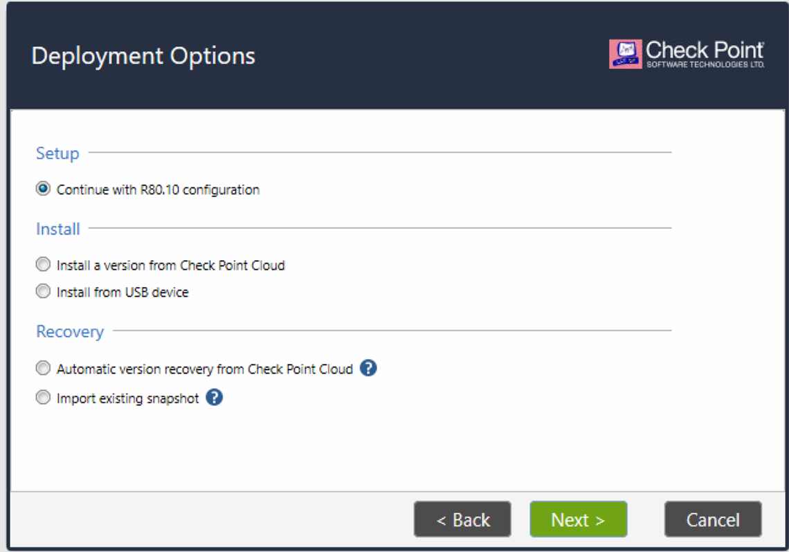

# Laboratorio 1: Configuracion de direccionamiento IP interno

|Equipo | hostname | IP | Mascara de red |
|--- | --- | --- | --- |
|Consola | cplabo | 10.0.1.250 | 255.255.255.0 |
|gw1 | fw1 | 10.0.1.251 | 255.255.255.0 |
|gw2 | fw2 | 10.0.1.252 | 255.255.255.0 |
|linux | cliente1 | 10.0.1.10 | 255.255.255.0 |

# Objetivos:

* Configurar las direcciones IP en los equipos de la tabla
* Lograr que ping de la consola a linux responda

https://soadeve.ddns.net:2453/#/login

Credenciales:
jvaldivia
Q1w2e3r4.
Html5 Console

admin/q1w2e3r4

Laboratorio 1:

Prendes solo vas a usar
100-localserver
105-WindowsServer
4-mgmt
3-gw
6-jump	 

=1 Poner IP a la consola=
Entramos a (4mgmt) en el laboratorio e
set interface eth0 ipv4-address 10.0.1.4 mask-length 28
set interface eth0 state on
Para comprobar que la guardo
Show interface eth0

=2 Poner IP al  firewall=
Entramos a (3-gw)
Nos loqueamos con admin
set interface eth0 ipv4-address 10.0.1.1 mask-length 28
Para comprobar que la guardo
Show interface eth0
Este comando levanta la interfaz
set interface eth0 state up

3 Desde el windows la intalacion via teamviewer
Abrimos en el brouser explorer  
Lo instalamos con el UI user interface paso a paso
Https://10.0.1.4
 E instaamos solo la consola
Ponemos el default gateway que es la IP q nos sacara de esa red en este caso 10.0.1.1
Ponemos un administrador diferente de admin
Rake
Pw: q1w2e3r4

Despues se instalara  el firewall

Https://10.0.1.1

Se configuraran las eth0#
Solo se instala el gateway

Se configura la eth1 con la ip de la red q desea alcanzar en este caso 10.0.1.96/28 entonces usaremosmos 10.0.1.101  con mascara 255.255.255.240

Nota en ip calc podemos calcular la mascara

Address:   10.0.1.96             
Netmask:   255.255.255.240 = 28  
Wildcard:  0.0.0.15              
Network:   10.0.1.96/28          
Broadcast: 10.0.1.111            
HostMin:   10.0.1.97             
HostMax:   10.0.1.110            
Hosts/Net: 14  

Ponemos nombre al firewalll: firewallrake
Seleccinamos q instale solo el firewall ya q la consola estara por separado , esto e una instalación distribuida .

Paso a paso del firewall

Nota cuando se instalan firewal y consola juntos se conoce como instalación standalone

Pide un activation key .
Zaxscdvf
Zaxscdvf

Cuando termina reinstalar la consola se puede downloadear la aplicación  de mgmt Smart consol 80.10 pero en este caso ya esta instalada

Abrimos la aplicación de la consola “Smart consol 80.10”
Marco error
Revisamos q lleguemos ala consola con ping 10.0.1.4 listo
En cuanto abre la aplicación de consola cambiamos a la ip 10.0.1.4  y cambiamos el usuario admin a el usuario que creamos
Rake
Pw q1w2e3r4

 consola  nos genera una llave  
Muy importante para q la consola comience a administrar el firewall
agregamos el new gateway
  - Objects
     - Network object
	- Gateway and servers
	 -New gateway

Cuidar como se llama el gateway  y la plataforma
Para este caso es

Paso a paso de la consola

Firewall rake
Openserver
Ip 10.0.1.1
Click en siguiente
Nos pide un  one time password  
Usamos
axscdvf

Esto se trae la topologia del firewall

New gateway para agregar el firewall que se configurara
El objeto del firewall que se abre en general prosperéis
En network management  
Elegimos get interfaces  whit topology y listo
Muestra
Eth0 y eth1

Nos vamos a securyty polici
hay dos formas de agregar políticas con los botones de la parte superior   
+ ——
    ____

O dando click en la celda de clean up rule y seleccionando above or below  

Hacemos 4 reglas básicas
1 administrar .
Source             Destination     Action.      Track  
Windows6.       Firewall		acept.       Log
			Consola
2 Stealth . Tira comunicaciones q vienen al firewall y consola
Source             Destination     Action.      Track  
Any 			 Firewall		drop      Log
			consol
3 navigation
Source             Destination     Action.      Track  
Windows		any        		accept      Log
4 clean up. Tira todo el trafico
Source             Destination     Action.      Track  
Any			any			drop       Log

Ahora instalamos políticas el firewall

1. Sincronizas gw con consola
2. Creas politico de any any
3. Instalas politic

Que cosas tienes que validar?

Ping 10.0.1.00
Pagina web www.dexperts.lab
Ssh con putty a la 10.0.1.100

Ver los logs en el tracker

W
