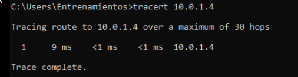
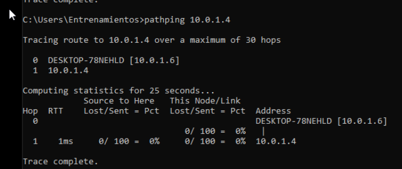
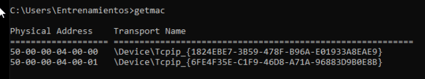
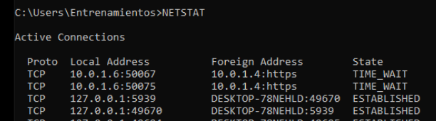

# Laboratorio MS:DOS 

#### Mas comandos Comando promp de MS-DOS

- help : muestra una lista con los comandos disponibles.  help (nombre de comando) muestra información sobre un
comando específico .

- tracert: Permite conocer los paquetes que vienen desde un host (punto de red). También se obtiene una estadística del RTT o latencia de red de esos paquetes, ofreciendo una estimación de la distancia a la que están los extremos de la comunicación.

- pathping: Combina la utilidad de ping y tracert. Es más informativo, por lo que tarda más tiempo para ejecutar. Después de enviar los paquetes a un destino determinado, se analiza la ruta tomada y se calcula la pérdida de paquetes y proporciona detalles entre dos host.

- getmac: Obtiene la mac del equipo donde se ejecuta. La dirección MAC es un identificador de 48 bits determinado y configurado por el IEEE y el fabricante (24 bits cada uno). Conocida también como dirección física es única para cada dispositivo.

- nslookup: Se emplea para conocer si el DNS está resolviendo correctamente los nombres y las IPs. También nos permite averiguar la dirección IP detrás de un determinado nombre de dominio. Si deseas convertir una dirección IP en un nombre de dominio, sólo tienes que escribirlo en el navegador y ver a dónde conduce.

- netstat: Comando potente que muestra estadísticas de la red y permite diagnósticos y análisis. Por defecto, muestra un listado de las conexiones activas de una computadora, tanto entrantes como salientes. Incluye el protocolo en uso, las tablas de ruteo, las estadísticas de las interfaces y el estado de la conexión.

- systeminfo : sirve para obtener la información sobre la PC o sistema como nombre del sistema, el procesador, la memoria RAM, la placa base o el almacenamiento interno que tiene.

Ejercicios:

- Ejercicio 1
- Ejercicio 2
- Ejercicio 3
